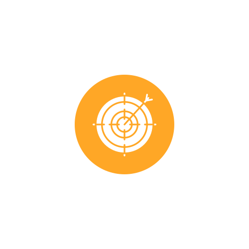
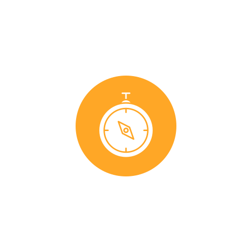
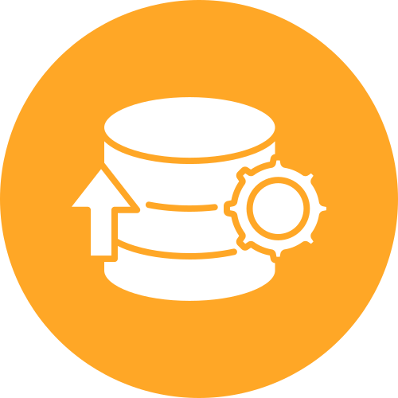
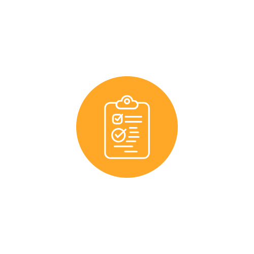

  

##   &nbsp;&nbsp;E-Commerce Performance & ROMI Analysis
 

>This project was developed as part of the **Data Analytics Bootcamp at [TripleTen](https://tripleten.com)**.  
>This project analyzes **marketing efficiency, user behavior, and financial performance** of the **Y.Afisha e-commerce platform**, combining cohort analysis, LTV/CAC computation, and Return on Marketing Investment (ROMI) evaluation.
>The analysis explores **traffic sources, conversion dynamics, retention, and profitability** — supporting data-driven marketing decisions.
>
>**Repository:** [https://github.com/MarcelaMaris/E-Commerce-Performance-ROMI-Analysis](https://github.com/MarcelaMaris/E-Commerce-Performance-ROMI-Analysis)

---
 

##   &nbsp;&nbsp;Objectives

- Examine the efficiency of each **marketing source** through CAC, ROI, and ROMI.  
- Understand **conversion and retention behavior** by cohort and channel.  
- Calculate **Lifetime Value (LTV)** and assess the balance between acquisition cost and long-term revenue.  
- Identify which cohorts and campaigns generate **sustainable marketing returns**.  

---

##   &nbsp;&nbsp;Feature Analysis
- **Cohort Analysis:** user segmentation by first purchase month to track retention and revenue over time.  
- **LTV & CAC Computation:** evaluates profitability by acquisition channel and month.  
- **ROMI Calculation:** measures marketing return by comparing LTV and CAC over cohorts.  
- **Filtering Incomplete Cohorts:** only complete observation periods are included to ensure unbiased metrics.  
- **ROMI Sensitivity Analysis (±10%):** tests the model’s robustness by simulating variations in CAC and LTV.  
- **Visual Reporting:** cohort heatmaps, retention curves, and ROMI matrices built with Seaborn and Matplotlib.

---

##   &nbsp;&nbsp;Dataset
**Files**
- `visits_log_us.csv` — user visits and session data.  
- `orders_log_us.csv` — order timestamps and purchase amounts.  
- `costs_us.csv` — marketing spend by source and month.

**Key Columns**
- `uid` — unique user identifier.  
- `buy_ts` — timestamp of purchase.  
- `source_id` — marketing source (1–10).  
- `revenue` — order amount.  
- `dt` — date of marketing spend.  

---

##   &nbsp;&nbsp;Conclusions
- **Efficient channels:** Sources **1**, **9**, and **10** achieved the **lowest CAC** (R$3.90–5.57) and **positive ROI**, showing strong efficiency.  
- **Inefficient channels:** Sources **3–5** had **negative ROI** despite high spending, indicating poor cost-to-revenue ratio.  
- **Conversion behavior:** Most purchases occur on **Day 0** — the same day as the first visit — emphasizing the need for strong first-impression campaigns.  
- **Retention:** Average orders per customer = **1.38**; cumulative **LTV > R$13** within nine months.  
- **ROMI trend:** Most cohorts become profitable from **Month 5** onward; **Sep 2017** reached ROMI = **1.42** by Month 8.  
- **Robustness:** Sensitivity tests confirmed that **June 2017** cohort remains profitable (ROMI > 1) even under stressed CAC (+10%) / LTV (–10%) scenarios.  

---

##   &nbsp;&nbsp;Recommendations
1. **Reallocate marketing budget** — reduce spend on sources 3-5 (negative ROI); reinforce sources 1, 9, 10.  
2. **Enhance first-visit experience** — clear calls-to-action, optimized landing pages, limited-time offers.  
3. **Boost retention & repurchase** — loyalty programs, personalized email offers, remarketing after 28 days.  
4. **Track cohorts monthly** — monitor ROMI evolution and identify saturation points.  
5. **Perform regular sensitivity checks** — test ROMI resilience under varying CAC/LTV assumptions.  
6. **Adopt a multi-device strategy** — performance is consistent across desktop and touch users.

---

##   &nbsp;&nbsp; Key Business Impact
- Identified the **most cost-effective acquisition channels**, supporting smarter media allocation.  
- Delivered actionable insights on **conversion timing** and **retention patterns**.  
- Introduced **ROMI sensitivity testing** to validate financial sustainability.  
- Enabled **data-driven marketing planning**, improving long-term profitability and resource efficiency.

---

##   &nbsp;&nbsp;Tech Stack
- **Languages & Libraries:** Python (3.10), Pandas, NumPy, Matplotlib, Seaborn  
- **Environment:** Jupyter Notebook  
- **Data Management:** CSV files (`data/samples/`), clean reproducible workflow with Pathlib  
- **Visualization:** Cohort heatmaps, retention curves, ROMI matrices  
- **Version Control:** Git & GitHub  
---

  📊 Designed & developed by <b>Marcela Maris</b> — Data Analytics Portfolio 
  <i>Marketing Analytics • Cohort Insights • ROI Optimisation</i>

---
